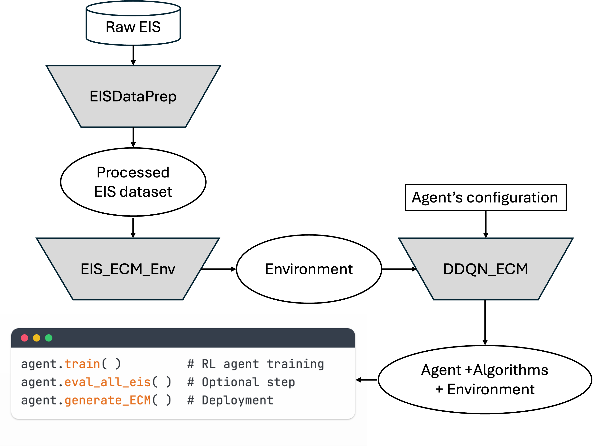

# AutoREC: Reinforcement Learning for Automated ECM Generation from EIS Data

<p align="center">
  
</p>

AutoREC is an open-source Python package for developing reinforcement learning
(RL) agents that automatically generate equivalent circuit models (ECMs) from
electrochemical impedance spectroscopy (EIS) data.

It formulates ECM construction as a Markov Decision Process and trains a Double
Deep Q-Network (DDQN) agent to mutate circuit representations, fit candidate
models, and learn which actions produce high-quality ECMs. The package includes
data preparation, training, evaluation, caching, prioritized replay, dead-loop
mitigation, and YAML-based configuration utilities.

In the AutoREC paper, the trained agent achieved over 99.6% success on synthetic
datasets and generalized to unseen experimental EIS data from several
electrochemical systems.


>  AutoREC is now published in arxiv. You can find the paper [here](https://doi.org/10.48550/arXiv.2604.27266). If you find AutoREC useful, please consider citing it in your work.
>
> A. Jaberi, Y. Kurniawan, et al., AutoREC: A software platform for developing reinforcement learning agents for equivalent circuit model generation from electrochemical impedance spectroscopy data

## Key Features

- DDQN-based ECM generation for EIS spectra
- Gene expression programming (GEP) circuit representation
- Prioritized experience replay for efficient learning
- Dead-loop mitigation strategy to efficiently explore a complex action space
  for circuit generation
- Cached circuit evaluations to reduce repeated fitting cost
- Data preparation tools for processed datasets and raw CSV files
- YAML-based configuration for reproducible training and evaluation
- Jupyter tutorials for data preparation, training, and evaluation

## Installation

### Prerequisites

- Conda, through Miniconda or Anaconda
- Python 3.10

AutoREC is packaged with a `pyproject.toml` file. The repository also provides
`environment.yml`, `requirements.txt`, and `setup_env.sh` as convenience entry
points that install from the package metadata.

### Option 1: Setup Script Using `environment.yml`

```bash
bash setup_env.sh
conda activate autorec_env
```

### Option 2: Manual Editable Install

```bash
conda create -n autorec_env python=3.10 -y
conda activate autorec_env
python -m pip install --upgrade pip
python -m pip install -e ".[notebook]"
```

In VS Code or Jupyter, select the kernel named `Python (autorec_env)`.

### Installation Check

```bash
python -m pip check
python -c "import autorec, autoeis, lcapy, tensorflow as tf; print('AutoREC environment ready')"
```

Note: the first time you import the agent, Julia will be automatically set up
and configured if it is not already available in the current environment.

### Fixing Segmentation Faults or Kernel Crashes

AutoREC uses AutoEIS/JuliaCall together with TensorFlow/JAX. In some terminal
or notebook sessions, Python can crash if TensorFlow, JAX, or other native
scientific libraries initialize before Julia.

For standalone scripts, add this at the very beginning of the file, before
importing NumPy, TensorFlow, JAX, Matplotlib, AutoEIS, or other AutoREC modules:

```python
from autorec.runtime import configure_autorec_runtime

configure_autorec_runtime(thread_count=1, warmup_autoeis=True)
```

For notebooks, run the same lines in the first cell before other imports. If
you do not want to add this setup cell to every notebook, install the AutoREC
kernel guard once in the active environment:

```bash
conda activate autorec_env
python scripts/install_autorec_kernel_guard.py
```

Then restart the notebook kernel.

The guard is installed only into the active Python environment's
`site-packages/sitecustomize.py`; it does not modify AutoREC source code or the
notebooks.

## Quick Start

Complete step-by-step tutorials are provided in the `tutorials` folder. This
section gives a quick overview of the main workflow.

### 1. Prepare Data

Load an existing processed dataset:

```python
from autorec.data_preparation import EISDataPrep

data_prep = EISDataPrep(path="PATH/data/examples/training_dataset.pkl", mode='load')
dataset = data_prep.load()
```

Or process raw CSV files:

```python
from autorec.data_preparation import EISDataPrep

# CSV files should contain freq, Z_real, and Z_imag columns.
data_prep = EISDataPrep(
    path="PATH/EIS_raw",
    mode="process")

dataset = data_prep.load()
data_prep.save("processed_training_data.pkl")
```

### 2. Train an Agent

Using the YAML configuration:

```python
from autorec.factory import pipeline_builder

dataprep, dataprep_eval, env, env_eval, agent = pipeline_builder(
    "PATH/configs_yaml/examples/demo_pipeline_config.yaml"
)

agent.train()
agent.save_model("PATH/final_model.keras")
```

Using classes directly:

```python
from autorec.environment import EIS_ECM_Env
from autorec.agent import DDQN_ECM
from autorec.utils import set_global_seed

set_global_seed(42, deterministic_ops=True)

env = EIS_ECM_Env(
    dataset=dataset,
    elements=["+", "/", "R", "L", "P"],
    seed=42,
    cache_enabled=True,
)

agent = DDQN_ECM(
    training_env=env,
    num_trials=1000,
    save_dir="demo_output",
    random_seed=42,
    gradient_steps=1,
)

agent.train()
agent.save_model("PATH/final_model.keras")
```

### 3. Evaluate an Agent

```python
eval_results = agent.eval_batch_eis(
    eis_indices=eval_indices,
    max_actions=action_cap,
    verbose=False  # Set to True to see progress for each EIS
)

mean_reward = eval_results['best_reward'].mean()
success_rate = eval_results['found_solution'].mean()

print(f"Success rate: {success_rate:.2%}")
print(f"Mean reward: {mean_reward:.4f}")
```

## Tutorials

The `tutorials` folder contains notebook walkthroughs for:

- Preparing EIS data
- Training an AutoREC agent
- Evaluating generated ECMs

Start there if you are using the package for the first time.

## Configuration

YAML Configuration examples are available in `configs_yaml/examples/`. The configuration
file should consist of the following sections: `dataprep`, `environment`, and `agent`.
Each section contains key-value pairs that correspond to the arguments of `EISDataPrep`,
`EIS_ECM_Env`, and `DDQN_ECM` classes, respectively.

There are some notes about the configuration file:

1. The `dataprep` and `environment` sections can have `training` and `eval` subsections.
   Without these subsections or if there is only `training` subsection, the same
   configuration values are used for both training and evaluation.
1. The `dataprep` section is optional. If it is omitted, the `dataset` argument for
   `EIS_ECM_Env` must be provided directly in the `environment` section. If the `dataprep`
   section is present, the `dataset` argument for `EIS_ECM_Env` will be automatically
   replaced with the processed dataset from `dataprep`.
1. The `dataprep` can also accept an additional argument `output` to specify the path to
   save the processed dataset as a pickle file. If `output` is not specified, the
   processed dataset is not exported.
1. The `dataset` argument for `EIS_ECM_Env` can be specified as a path to a processed
   dataset pickle file. The factory loads the dataset from this path and passes it to the
   environment constructor.
1. The `training_env` and `eval_env` arguments for `DDQN_ECM` should not be specified
   directly in the configuration file. Instead, the factory creates the training and
   evaluation environments from the `environment` section and passes them to the agent
   constructor.

> [!NOTE]
> Configuration values may include the special environment variable
> `${AUTOREC_ROOT}`, which refers to the root directory of the AutoREC repository.
> The variable is expanded when the configuration file is loaded.

Data preparation options:

```yaml
path: ${AUTOREC_ROOT}/data/examples/training_dataset.pkl
mode: load
evaluation: false
perform_linKK_validation: false
tol_linKK: 5.0E-2
frequency_bounds:
  - null
  - null
frequency_npoints: null
eis_features:
  - ImZ
  - phi
  - mag
  - nphi
output: data/processed_training_dataset.pkl
```

Environment options:

```yaml
dataset: "data/examples/training_dataset.pkl"
elements:
  - "+"
  - "/"
  - R
  - L
  - P
initial_state:
  - +RRRRRR
  - ++RRRRRR
  - +++RRRRRR
seed: 42
chromosome_HEAD_len: 10
cache_enabled: true
cache_capacity: 20000
cache_type: lru
```

The `elements` list controls the environment's state encoding and action space. Use the same
elements in the same order when evaluating or continuing training with a saved model. Both
the resistor (`R`) and at least one topology operator (`+` or `/`) are required; `L`, `C`,
and `P` are optional.

Agent options:

```yaml
save_dir: "results/demo"
save_start: 0
save_frequency: 500
action_cap: null
random_seed: 42
num_trials: 1000
episodes_trial: 1
gamma: 0.99
continuous_deadloop: 2
latent_deadloop: 4
invalid_terminals: false
initial_epsilon: 1.0
epsilon_min: 0.1
epsilon_decay: 0.99968
start_decay: 10
bayesian: false
hidden_layers:
  - type: Dense
    units: 40
    activation: relu
  - type: Dense
    units: 40
    activation: relu
optimizer:
  type: Adam
  learning_rate: 0.0005
batch_size: 150
train_frequency: 5
gradient_steps: 1
update_target_frequency: 1000
NN_sleep: 1000
buffer_capacity: 15000
prioritized_replay_alpha: 0.6
prioritized_replay_eps: 1.0E-6
initial_beta: 0.4
beta_jump: 1.06
start_jump: null
anneal_fraction: null
final_beta: 0.7
```

`hidden_layers` accepts a sequence of built-in Keras layer configurations. Each item needs a
`type` matching a class in `tf.keras.layers`; the remaining keys are passed to that layer's
constructor. AutoREC supplies the input layer and the linear Q-value output layer. For example:

```yaml
hidden_layers:
  - type: Dense
    units: 64
    activation: relu
  - type: Dropout
    rate: 0.2
  - type: LayerNormalization
```

`optimizer` accepts a configuration for a built-in Keras optimizer, with `learning_rate` set
to either a number or a nested built-in Keras schedule configuration. Optimizer and schedule
types are case-sensitive and must match their Keras class names. A pre-initialized optimizer
object can also be supplied when constructing `DDQN_ECM` directly. For example:

```yaml
optimizer:
  type: Adam
  learning_rate:
    type: ExponentialDecay
    initial_learning_rate: 0.0005
    decay_steps: 1000
    decay_rate: 0.96
    staircase: true
```

Training recommendations:

- Start with the provided default configuration.
- Increase `num_trials` for diverse datasets or more complex ECM families.
- Reduce `num_trials` for small demonstrations or narrowly defined circuit sets.
- Keep `gradient_steps: 1` as a baseline. Increasing it samples additional replay mini-batches
  and applies one optimizer update per batch, increasing training cost and potentially
  destabilizing learning if set too high.
- Keep caching enabled unless memory use becomes a problem.

## How AutoREC Works

AutoREC represents ECM topologies as GEP chromosome strings. For example,
`+/RPRRRR` represents an R in series with (P parallel to R).

Circuit symbols:

- `+`: series connection
- `/`: parallel connection
- `R`: resistor
- `L`: inductor
- `C`: Capacitor
- `P`: constant phase element

Training loop:

1. The environment selects an EIS spectrum and initializes a circuit state.
2. The DDQN agent chooses an action that mutates one chromosome position.
3. The environment converts the chromosome to a circuit and fits it to the EIS data.
4. Rewards are computed from fit quality metrics such as R2 and chi-square as well as circuit complexity.
5. The agent stores the transition in prioritized replay. At each `train_frequency` interval,
   it samples and updates `gradient_steps` replay mini-batches.
6. The process continues until a valid solution is found or the action budget is reached.

The trained agent can then propose ECM topologies for new EIS spectra and report
the best circuit, fitted parameters, metrics, and action history.

## Project Structure

```text
AutoREC/
|-- pyproject.toml                  # Package metadata and dependencies
|-- ruff.toml                       # Ruff linting and formatting configuration
|-- .pre-commit-config.yaml         # Pre-commit hook configuration
|-- .editorconfig                   # Editor-independent whitespace settings
|-- Makefile                        # Development setup and linting commands
|-- environment.yml                 # Conda environment that installs this package
|-- requirements.txt                # Pip entry point that installs from pyproject.toml
|-- setup_env.sh                    # Convenience conda setup script
|-- Dockerfile                      # Container image definition for CLI workflows
|-- .dockerignore                   # Docker build-context exclusions
|-- README.md
|-- data/                           # Example processed datasets
|-- configs_yaml/
|   `-- examples/                   # Example YAML configurations
|-- example/                        # Example Python entry points
|-- models/                         # Runtime model outputs and example models
|-- results/                        # Runtime evaluation outputs, ignored except .gitkeep
|-- runs/                           # Runtime training outputs, ignored except .gitkeep
|-- scripts/
|   `-- install_autorec_kernel_guard.py
|-- src/
|   `-- autorec/
|       |-- agent.py                # DDQN agent and evaluation helpers
|       |-- data_preparation.py     # Data loading, processing, and validation
|       |-- environment.py          # RL environment for ECM generation
|       |-- factory/                # Config-driven builders and model construction
|       |   |-- __init__.py
|       |   |-- agent.py            # Agent builder
|       |   |-- dataprep.py         # Data-preparation builder
|       |   |-- environment.py      # Environment builder
|       |   |-- model.py            # Keras model construction from config
|       |   |-- optimizer.py        # Keras optimizer construction from config
|       |   |-- pipeline.py         # Complete pipeline builder
|       |   `-- utils.py            # Configuration loading helpers
|       |-- utils.py                # Shared utilities
|       |-- runtime.py              # Runtime setup helpers
|       `-- optimized_data_structures/
`-- tutorials/                      # Step-by-step notebook tutorials
```

<p align="center">
  
</p>

## Command Line Interface

AutoREC also provides a command line interface for running common workflows
without writing a separate Python script. After installing the package, the
`autorec` command is available in the active environment:

```bash
python -m pip install -e .
autorec --help
```

The CLI configures the AutoREC runtime before importing TensorFlow, JAX,
AutoEIS, or other scientific libraries. This is the recommended command-line
entry point for preprocessing, training, evaluation, and inference workflows.

### 1. Preprocess Data

Use `autorec preprocess` to process raw EIS CSV files or validate an existing
processed dataset. Raw CSV files should contain `freq`, `Z_real`, and `Z_imag`
columns.

```bash
autorec preprocess \
  --input tutorials/EIS_raw_demo \
  --output data/processed_training_data.pkl \
  --mode process \
  --perform-linkk-validation \
  --tol-linkk 0.05 \
  --frequency-bounds none none \
  --frequency-npoints 80 \
  --evaluation \
  --summary
```

The interpolation options are optional. For `--frequency-bounds`, use `none`
or `null` for either bound to use that spectrum's minimum or maximum frequency.

To validate an existing processed dataset without reprocessing raw CSV files:

```bash
autorec preprocess \
  --input data/examples/training_dataset.pkl \
  --mode load \
  --evaluation \
  --summary
```

### 2. Train an Agent

Use `autorec train` with a pipeline YAML configuration containing `environment`
and `agent` sections and, optionally, a `dataprep` section. Without `dataprep`,
the environment section must point to the processed dataset. The agent section
controls training parameters and output paths.
Use `--output-dir` to override the YAML `agent.save_dir` for training artifacts.
If omitted, the CLI uses the `agent.save_dir` value from the config file.

```bash
autorec train \
  --config configs_yaml/examples/demo_pipeline_config.yaml \
  --output-dir runs/demo_train
```

### 3. Evaluate an Agent

Use `autorec evaluate` to load a trained model and evaluate generated ECMs for
selected rows, a random sample, or the full dataset.

**Note:** The argument `--model` takes precedence over the `model` key inside the YAML configuration. If both are provided, the CLI uses the model path specified by `--model`.

Evaluate specific row positions:

```bash
autorec evaluate \
  --config configs_yaml/examples/demo_pipeline_config.yaml \
  --model models/examples/agent_trained.keras \
  --indices 0,4,10 \
  --output-dir results/evaluate_demo
```

Evaluate a random sample:

```bash
autorec evaluate \
  --config configs_yaml/examples/demo_pipeline_config.yaml \
  --model models/examples/agent_trained.keras \
  --num-samples 20 \
  --output-dir results/evaluate_demo
```

Evaluate all rows:

```bash
autorec evaluate \
  --config configs_yaml/examples/demo_pipeline_config.yaml \
  --model models/examples/agent_trained.keras \
  --all-rows \
  --output-dir results/evaluate_demo
```

By default, evaluation uses the evaluation environment when the configuration
defines one. Add `--use-training-env` to evaluate against the training dataset.
Use `--output-dir` to override the YAML `agent.save_dir`; this keeps
agent-created files such as model summaries, generated circuit images, GIFs, and
evaluation CSV/Pickle files in the same runtime output directory. If
`--output-dir` is omitted, the CLI uses the `agent.save_dir` value from the
config file.

### 4. Run Inference

`autorec infer` is an alias for `autorec evaluate`. Use it when the goal is to
apply a trained model to EIS rows and inspect the proposed ECMs rather than run
a formal evaluation report.

```bash
autorec infer \
  --config configs_yaml/examples/demo_pipeline_config.yaml \
  --model models/examples/agent_trained.keras \
  --indices 0 \
  --max-actions 24 \
  --output-dir results/inference_demo \
  --run-id inference_demo
```

Useful shared options:

- `--output-dir`: override `agent.save_dir` from the YAML file for training,
  evaluation, and inference outputs.
- `--threads`: control BLAS/OpenMP/NumExpr thread pools.
- `--seed`: set the random seed for training, evaluation, and sampling.
- `--skip-autoeis-warmup`: skip the AutoEIS/Julia warmup step.
- `--show-tf-logs`: show TensorFlow logs that are hidden by default.

## Docker

AutoREC includes a Dockerfile for running the CLI in a reproducible container.
The image contains the package code and dependencies. Data, trained models, and
run outputs should be mounted from the host rather than baked into the image.

Runtime directories:

- `data/`: input datasets mounted at `/app/data`
- `models/`: promoted or exported models mounted at `/app/models`
- `runs/`: training outputs mounted at `/app/runs`
- `results/`: evaluation and inference outputs mounted at `/app/results`

Build the image:

```bash
docker build -t autorec:latest .
```

Check the CLI:

```bash
docker run --rm autorec:latest --help
```

Run training with mounted runtime directories:

```bash
docker run --rm \
  -v "$PWD/data:/app/data" \
  -v "$PWD/configs_yaml:/app/configs_yaml" \
  -v "$PWD/models:/app/models" \
  -v "$PWD/runs:/app/runs" \
  -v "$PWD/results:/app/results" \
  autorec:latest train \
  --config /app/configs_yaml/examples/demo_docker_pipeline_config.yaml \
  --output-dir /app/runs/demo_train
```

Run inference with an existing model:

```bash
docker run --rm \
  -v "$PWD/data:/app/data" \
  -v "$PWD/configs_yaml:/app/configs_yaml" \
  -v "$PWD/models:/app/models" \
  -v "$PWD/results:/app/results" \
  autorec:latest infer \
  --config /app/configs_yaml/examples/demo_docker_pipeline_config.yaml \
  --model /app/models/examples/agent_trained.keras \
  --indices 0 \
  --output-dir /app/results/inference_demo
```

Note: if you want to open a shell instead of the default entrypoint, override
the entrypoint for that `docker run` command:

```bash
docker run --rm -it --entrypoint /bin/bash autorec:latest
```

This is useful for inspecting the container or running commands manually without
changing the Dockerfile.

## Development Notes

The codebase includes support for saving models and training outputs. More
efficient training and circuit representation are under development for public use.

### Development Setup

For development work, first create and activate the AutoREC environment:

```bash
conda create -n autorec_env python=3.10 -y
conda activate autorec_env
python -m pip install --upgrade pip
```

Then install the package with development dependencies and enable the pre-commit
hooks:

```bash
make setup-dev
```

This command installs AutoREC in editable mode with the development dependencies
and runs `pre-commit install`.

If you also want the notebook dependencies, run:

```bash
make setup-notebook-dev
```

### Pre-commit Hooks

AutoREC uses pre-commit hooks to keep formatting and linting consistent before
changes are committed. After running `make setup-dev` or
`make setup-notebook-dev`, the configured checks will run automatically whenever
you commit changes with `git commit`.

To manually run the same checks on all files, use:

```bash
make lint
```

Some hooks may modify files automatically, such as removing trailing whitespace,
fixing missing final newlines, or formatting Python files. If that happens
during a commit, stage the modified files and commit again:

```bash
git add .
git commit -m "Your commit message"
```

To skip the hooks in exceptional cases, use:

```bash
git commit --no-verify
```

This should be used sparingly, since it bypasses the formatting and linting
checks.

## Citation

If you use AutoREC, please cite the accompanying AutoREC paper. You can find the paper [here](https://doi.org/10.48550/arXiv.2604.27266).

> AutoREC: A software platform for developing reinforcement learning agents for equivalent circuit model generation from electrochemical impedance spectroscopy data.

## License

This project is distributed under the MIT license.
